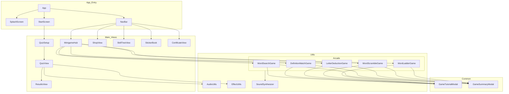

# Current Dependency Graph

```mermaid
graph TD
    subgraph App_Entry
        App --> SplashScreen
        App --> StartScreen
        App --> NavBar
    end

    subgraph Main_Views
        StartScreen --> QuizSetup
        QuizSetup --> QuizView
        QuizView --> ResultsView
        NavBar --> MinigameHub
        NavBar --> ShopView
        NavBar --> SkillTreeView
        NavBar --> StickerBook
        NavBar --> CertificateView
    end

    subgraph Arcade
        MinigameHub --> WordSearchGame
        MinigameHub --> DefinitionMatchGame
        MinigameHub --> LetterDeductionGame
        MinigameHub --> WordScrambleGame
        MinigameHub --> WordLadderGame
    end

    subgraph Common
        WordSearchGame --> GameTutorialModal
        WordSearchGame --> GameSummaryModal
        DefinitionMatchGame --> GameTutorialModal
        DefinitionMatchGame --> GameSummaryModal
        LetterDeductionGame --> GameTutorialModal
        LetterDeductionGame --> GameSummaryModal
        WordScrambleGame --> GameTutorialModal
        WordScrambleGame --> GameSummaryModal
        WordLadderGame --> GameTutorialModal
        WordLadderGame --> GameSummaryModal
    end

    subgraph Utils
        QuizView --> AudioUtils
        QuizView --> EffectUtils
        Arcade --> SoundSynthesizer
    end
```
